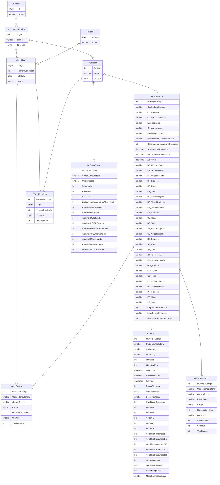

# Banco de dados do TSE Parser

O banco de dados tem a seguinte estrutura



A tabela `VotosMunicipio` uma tabela consolidada com os votos agrupados por município. 
Embora os mesmos dados pudessem ser obtidos da tabela `VotosSecao`, ter uma tabela com estes dados agrupados agiliza algumas consultas.

### Algumas consultas úteis

Votos para Presidente no PT e no PR, por UF.
```
SELECT      M.UFSigla,
            VM.NumeroCandidato,
            SUM(VM.QtdVotos) as QtdVotos
FROM        Municipio M with (NOLOCK)
INNER JOIN  VotosMunicipio VM with (NOLOCK)
    ON      VM.MunicipioCodigo = M.Codigo
        AND VM.Cargo = 5
        AND VM.NumeroCandidato IN (13, 22)
GROUP BY    M.UFSigla, VM.NumeroCandidato
ORDER BY    M.UFSigla, SUM(VM.QtdVotos) DESC
```

